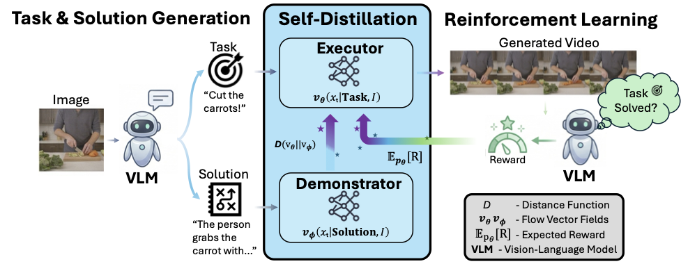

# World Model Self-Distillation

Official repository for **World Model Self-Distillation: Training World Models to Solve General Tasks**.

## Abstract

World Model Self-Distillation (WMSD) adapts pretrained video generation models into task-solving world models without paired task demonstrations. Starting from scene images, WMSD generates compact task instructions and detailed solution descriptions, distills the solution-conditioned Demonstrator into an instruction-conditioned Executor, and further improves the Executor with VLM feedback while keeping the original model as a stabilizing anchor. The resulting models improve task completion and physical consistency on WorldTasksBench across LTX-2 and HunyuanVideo-1.5, while preserving efficient inference.

## Resources

- Project page: https://sebastian-stapf.github.io/world-model-self-distillation/
- Dataset: https://huggingface.co/datasets/wiqzard2000/WorldTasks
- Weights: https://huggingface.co/wiqzard2000/World-Model-Self-Distillation

Code will be released later.
